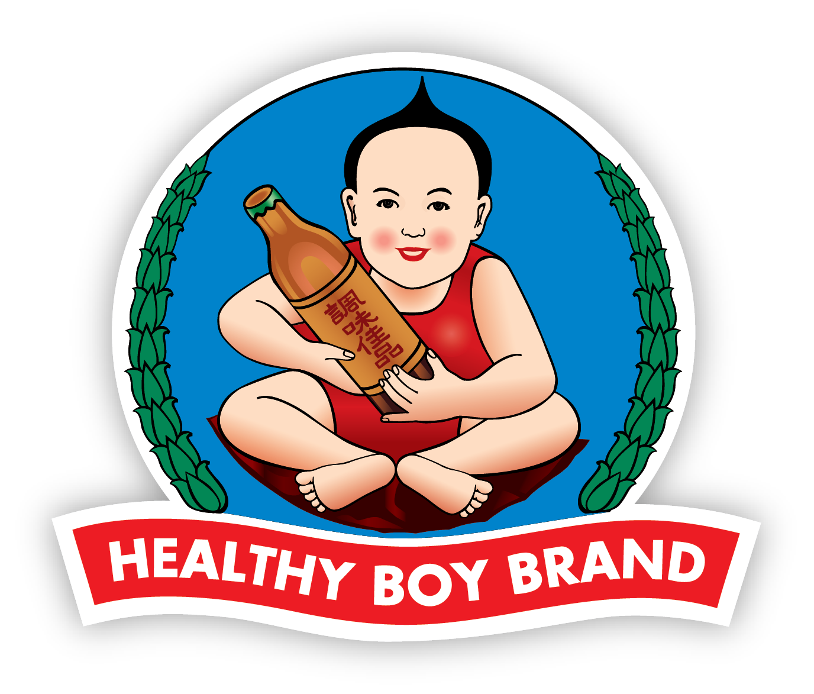

<h1 style="font-family: grotesk"> Healthyboy - Restaurant </h1>

I made a themed restaurant about the anime I love, and the fact that the food always looks amazing!

 

<h2 style="font-family: grotesk"> Live Page </h2>

Here's the live page : [LIVE](https://kimjacobus.github.io/healthyboy/)

<h2 style="font-family: grotesk">Technologies used</h2>

- `Bootstrap` 
front-end toolkit

- `Vite` 
compiler

<h2 style="font-family: grotesk">Fonts used</h2>

fonts used from : velvetyne.fr

- `terminal grotesque`
By Raphaël Bastide, Jérémy Landes

- `grotesk`
By Frank Adebiaye

<h2 style="font-family: grotesk">Contact</h2>

- jacobus.kim@gmail.com

----

